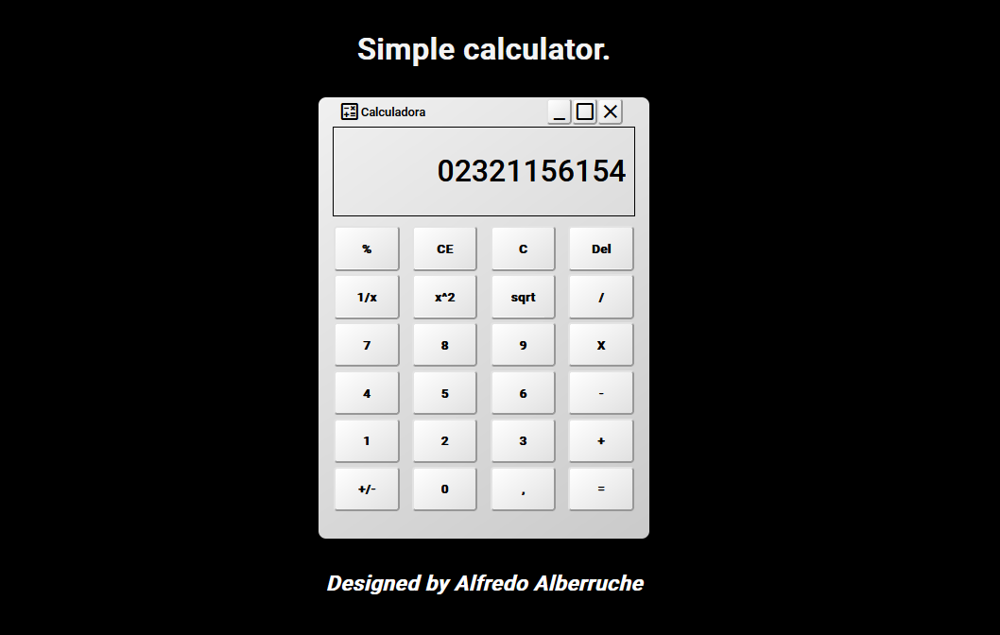

<h1 align="center">Hi! This is a simple calculator designed with vanilla CSS and Js.</h1>
<h2>Preview</h>
Overview
This is a simple calculator application built with HTML, CSS, and JavaScript. The calculator allows users to perform basic arithmetic operations (addition, subtraction, multiplication, and division) as well as more advanced operations such as square, square root, percentage, and inversion. The calculator supports both mouse interaction and keyboard input, enhancing accessibility and usability.

## Features
Basic Arithmetic Operations: Add, subtract, multiply, and divide.
Advanced Functions: Calculate square, square root, percentage, and inverse.
Error Handling: Prevents division by zero and other common errors.
Keyboard Support: Use the numeric keypad and standard keyboard operators (+, -, *, /, Enter, Backspace) for calculations.
Responsive Design: Adapts to different screen sizes.
Accessibility: Includes ARIA labels and live regions for improved accessibility.

## Installation
Clone the repository to your local machine:
git clone https://github.com/Alflow/Calculator.git
cd simple-calculator

## Usage
Mouse Interaction
Click the buttons on the calculator interface to perform operations. The display shows the current input and result.

## Keyboard Interaction
You can use the following keys on your keyboard:
Numbers (0-9): Enter digits.
*Operators (+, -, , /): Perform arithmetic operations.
Enter/Equals (=): Calculate the result.
Backspace (Backspace): Delete the last digit entered.
Escape (Esc): Clear the current input.
Percent (%): Calculate percentage.
Decimal Point (.): Add a decimal point.

## Accessibility
- This calculator is designed with accessibility in mind:
 ARIA Labels: All buttons and interactive elements have appropriate ARIA labels to support screen readers.
 Keyboard Navigation: The calculator can be fully operated using a keyboard.

## Demo
https://alflow.github.io/Calculator/

